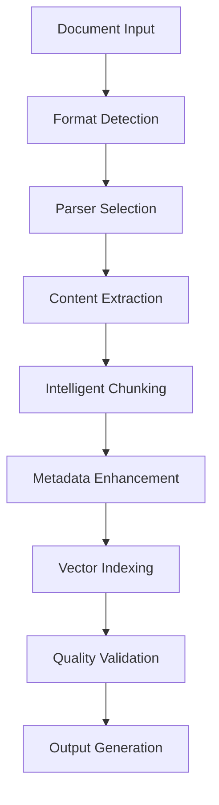

# RAG Document Processing Utility

Welcome to the comprehensive documentation for the RAG Document Processing Utility - a sophisticated tool that transforms various document formats into optimized structures for RAG (Retrieval-Augmented Generation) applications.

## 🚀 What is RAGPrep?

RAGPrep is an intelligent document processing utility that goes beyond simple text extraction. It uses advanced AI techniques to understand document structure, extract meaningful metadata, and create optimally chunked content for RAG systems.

### Key Features

- **🤖 LLM-Powered Processing**: Advanced metadata extraction using language models
- **📄 Multi-format Support**: PDF, DOCX, HTML, and more with specialized parsers
- **🧩 Intelligent Chunking**: Semantic, structural, and hybrid chunking strategies
- **🖼️ Multimodal Handling**: Tables, images, and mathematical content processing
- **📊 Quality Assurance**: Comprehensive validation at every processing stage
- **🔍 Vector Integration**: Multi-index strategy for efficient retrieval

## 🏗️ Architecture Overview

The utility is built around a **multi-stage, intelligence-enhanced pipeline**:



## 🚀 Quick Start

1. **Installation**
   ```bash
   git clone <repository-url>
   cd RAGPrep
   pip install -r requirements.txt
   ```

2. **Configuration**
   ```bash
   cp env.example .env
   # Edit .env with your API keys
   ```

3. **First Document**
   ```python
   from src.processor import DocumentProcessor
   
   processor = DocumentProcessor()
   result = processor.process_document("path/to/document.pdf")
   ```

## 📚 Documentation Sections

### User Guide
- **[Getting Started](user-guide/getting-started.md)**: Setup and first steps
- **[Configuration](user-guide/configuration.md)**: Customizing the utility
- **[Processing Pipeline](user-guide/processing-pipeline.md)**: Understanding the workflow
- **[Quality Assurance](user-guide/quality-assurance.md)**: Ensuring output quality

### API Reference
- **[Core Classes](api/core-classes.md)**: Main processing classes
- **[Parsers](api/parsers.md)**: Document format handlers
- **[Chunkers](api/chunkers.md)**: Content segmentation strategies
- **[Metadata Extractors](api/metadata-extractors.md)**: AI-powered extraction

### Configuration
- **[Settings](configuration/settings.md)**: All configuration options
- **[Schemas](configuration/schemas.md)**: Data structure definitions
- **[Examples](configuration/examples.md)**: Configuration examples

### Development
- **[Setup](development/setup.md)**: Development environment
- **[Architecture](development/architecture.md)**: System design
- **[Testing](development/testing.md)**: Testing strategies
- **[Contributing](development/contributing.md)**: How to contribute

## 🎯 Use Cases

- **Academic Research**: Process research papers and extract key findings
- **Technical Documentation**: Convert manuals into searchable knowledge bases
- **Legal Documents**: Extract entities and relationships from contracts
- **Business Reports**: Transform reports into actionable insights
- **Multimodal Content**: Handle documents with tables, images, and formulas

## 📊 Performance Metrics

Our quality targets ensure reliable processing:

| Metric | Target | Current |
|--------|--------|---------|
| Content Accuracy | >95% | 🟡 92% |
| Structure Preservation | >90% | 🟢 94% |
| Metadata Quality | >85% | 🟢 87% |
| Processing Speed | <30s | 🟢 25s |
| Memory Usage | <2GB | 🟢 1.8GB |

## 🤝 Contributing

We welcome contributions! See our [Contributing Guide](development/contributing.md) for details.

## 📄 License

This project is licensed under the MIT License.

---

**Ready to get started?** Check out our [Getting Started Guide](user-guide/getting-started.md) or dive into the [API Reference](api/core-classes.md).
